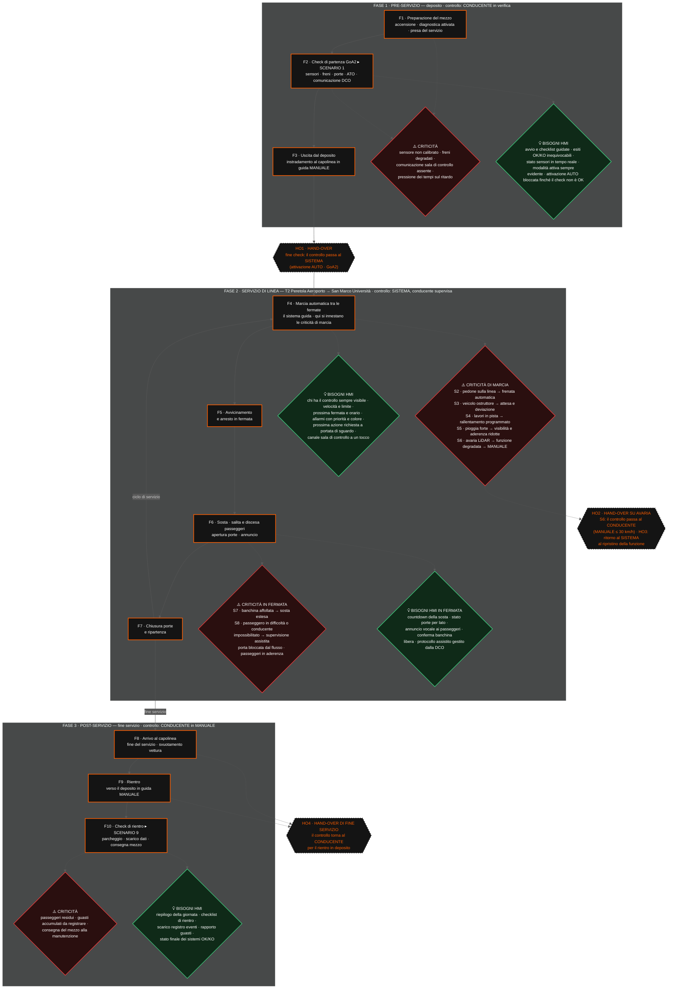

# Fasi del servizio · Tram semi-autonomo GoA2 · Linea T2 Firenze

Annotazione di criticità, bisogni HMI e hand-over di controllo. Gli scenari S1–S9 sono quelli del video-dimostrativo.

```mermaid
%%{init: {"theme":"dark","themeVariables":{"background":"#0A0A0A","primaryColor":"#141414","primaryBorderColor":"#FF5E00","primaryTextColor":"#ffffff","lineColor":"#5a5a5a","secondaryColor":"#1e1e1e","tertiaryColor":"#111111","fontFamily":"Helvetica, Arial, sans-serif","fontSize":"13px"}}}%%
flowchart TD
  subgraph PRE["FASE 1 · PRE-SERVIZIO — deposito · controllo: CONDUCENTE in verifica"]
    direction TB
    F1["F1 · Preparazione del mezzo<br/>accensione · diagnostica attivata · presa del servizio"]
    F2["F2 · Check di partenza GoA2 ▸ SCENARIO 1<br/>sensori · freni · porte · ATO · comunicazione DCO"]
    F3["F3 · Uscita dal deposito<br/>instradamento al capolinea in guida MANUALE"]
    F1 --> F2 --> F3
    K1{"⚠️ CRITICITÀ<br/>sensore non calibrato · freni degradati ·<br/>comunicazione sala di controllo assente ·<br/>pressione dei tempi sul ritardo"}
    N1{"💡 BISOGNI HMI<br/>avvio e checklist guidate · esiti OK/KO inequivocabili ·<br/>stato sensori in tempo reale · modalità attiva sempre<br/>evidente · attivazione AUTO bloccata finché il check non è OK"}
    F1 -.-> K1
    F2 -.-> K1
    F2 -.-> N1
  end

  subgraph SER["FASE 2 · SERVIZIO DI LINEA — T2 Peretola Aeroporto → San Marco Università · controllo: SISTEMA, conducente supervisa"]
    direction TB
    F4["F4 · Marcia automatica tra le fermate<br/>il sistema guida · qui si innestano le criticità di marcia"]
    F5["F5 · Avvicinamento<br/>e arresto in fermata"]
    F6["F6 · Sosta · salita e discesa passeggeri<br/>apertura porte · annuncio"]
    F7["F7 · Chiusura porte<br/>e ripartenza"]
    F4 --> F5 --> F6 --> F7 -->|"ciclo di servizio"| F4
    K4{"⚠️ CRITICITÀ DI MARCIA<br/>S2 · pedone sulla linea → frenata automatica<br/>S3 · veicolo ostruttore → attesa e deviazione<br/>S4 · lavori in pista → rallentamento programmato<br/>S5 · pioggia forte → visibilità e aderenza ridotte<br/>S6 · avaria LiDAR → funzione degradata → MANUALE"}
    K6{"⚠️ CRITICITÀ IN FERMATA<br/>S7 · banchina affollata → sosta estesa<br/>S8 · passeggero in difficoltà o conducente<br/>impossibilitato → supervisione assistita<br/>porta bloccata dal flusso · passeggeri in aderenza"}
    N4{"💡 BISOGNI HMI<br/>chi ha il controllo sempre visibile · velocità e limite ·<br/>prossima fermata e orario · allarmi con priorità e colore ·<br/>prossima azione richiesta a portata di sguardo ·<br/>canale sala di controllo a un tocco"}
    N6{"💡 BISOGNI HMI IN FERMATA<br/>countdown della sosta · stato porte per lato ·<br/>annuncio vocale ai passeggeri · conferma banchina<br/>libera · protocollo assistito gestito dalla DCO"}
    F4 -.-> K4
    F4 -.-> N4
    F6 -.-> K6
    F6 -.-> N6
  end

  subgraph POST["FASE 3 · POST-SERVIZIO — fine servizio · controllo: CONDUCENTE in MANUALE"]
    direction TB
    F8["F8 · Arrivo al capolinea<br/>fine del servizio · svuotamento vettura"]
    F9["F9 · Rientro<br/>verso il deposito in guida MANUALE"]
    F10["F10 · Check di rientro ▸ SCENARIO 9<br/>parcheggio · scarico dati · consegna mezzo"]
    F8 --> F9 --> F10
    K10{"⚠️ CRITICITÀ<br/>passeggeri residui · guasti accumulati da registrare ·<br/>consegna del mezzo alla manutenzione"}
    N10{"💡 BISOGNI HMI<br/>riepilogo della giornata · checklist di rientro ·<br/>scarico registro eventi · rapporto guasti ·<br/>stato finale dei sistemi OK/KO"}
    F10 -.-> K10
    F10 -.-> N10
  end

  HO1{{"HO1 · HAND-OVER<br/>fine check: il controllo passa al SISTEMA<br/>(attivazione AUTO · GoA2)"}}
  HO2{{"HO2 · HAND-OVER SU AVARIA<br/>S6: il controllo passa al CONDUCENTE<br/>(MANUALE ≤ 30 km/h) · HO3: ritorno al SISTEMA<br/>al ripristino della funzione"}}
  HO4{{"HO4 · HAND-OVER DI FINE SERVIZIO<br/>il controllo torna al CONDUCENTE<br/>per il rientro in deposito"}}

  F3 --> HO1 --> F4
  K4 -.-> HO2
  F7 -->|"fine servizio"| F8
  F8 -.-> HO4
  F9 -.-> HO4

  classDef fase fill:#141414,stroke:#FF5E00,color:#ffffff,stroke-width:2px
  classDef criticita fill:#2a0f0f,stroke:#FF3B3B,color:#ffffff,stroke-width:1.5px
  classDef bisogno fill:#0f2a18,stroke:#3DDC84,color:#ffffff,stroke-width:1.5px
  classDef handover fill:#141414,stroke:#FFFFFF,color:#FF5E00,stroke-width:2px,stroke-dasharray:4 3
  class F1,F2,F3,F4,F5,F6,F7,F8,F9,F10 fase
  class K1,K4,K6,K10 criticita
  class N1,N4,N6,N10 bisogno
  class HO1,HO2,HO4 handover
```
